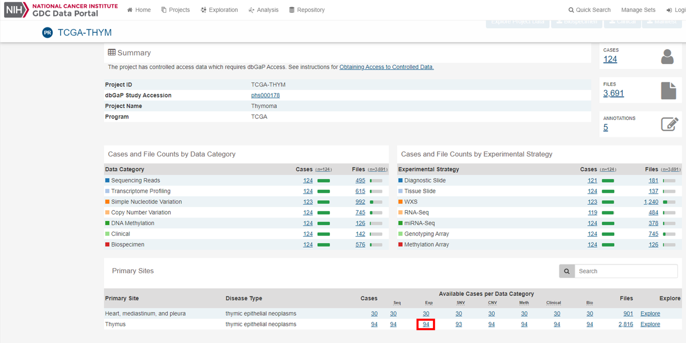

# Obtaining genomic data from the Genomics Data Commons Data Portal

This GitHub repository is meant to give step by step instructions on how to obtain
RNA-seq count files from the [Genomic Data Commons Data Portal](https://portal.gdc.cancer.gov/).
This is intended to help students that are relatively new to coding, but is still
intended to be run from the command line.

I this example I will go through how to obtain RNA-seq counts from a TCGA dataset.
I have never tried downloading data that was not from TCGA, so I cannot guarantee that this
pipeline will work for all data from GDC. However, the general principles on how to combine the files
will be relevant to all datasets and should give enough guidance that someone with a little
bit of coding experience can figure out how to combine files from other datasets.

First, go to the [Genomic Data Commons Data Portal](https://portal.gdc.cancer.gov/) page.


You can see from the home page that there are several ways to choose your dataset. You
can select a dataset based on the project (left side) or based on the tissue (right side).
I chose to use the "Projects" and filtered on the program, TCGA (Red square, left side).


You can then choose a tissue site using the "Primary Site" selection box above the
"Program" selection box. I am going to use Thymus simply because this is a relatively small dataset.
Once you have selected your tissue site, the projects will come up in a table on the bottom
right. I only have one listed. Click into that project by clicking on the project name.

Inside the project page, you can select the file types that you want or the samples that
you want. I want to look at expression data (RNA-seq), and I only want to look at the samples
from the Thymus. I am going to click on the "94" under the "Exp" on the bottom row (Red square).



This will take you back to a page that looks like the projects page, but instead shows samples.
For my project I wanted RNA-seq data, so I selected "transcriptome profiling" in the "Data Category"
selection box, "Gene Epxression Quantification" in the "Data Type" selection box, "RNA-seq"
in the "Experimental Strategy" selection box and "HTSeq - Counts" in the "Workflow Type"
selection box (see Red squares on the left). For some data analysis (e.g., unsupervised clustering
like KMeans or Heirarchal Clustering) you might want to use the FPKM files instead of the
raw counts. Alternatively you can normalize your own counts using
[normalize_rna_counts.py](https://github.com/davidwsant/normalize-rna-counts). More
info about this will be provided later. After you have selected your file types, added all
of the files to the cart (Green box).


Now click on the "Cart" button (top right). It will have all of the files that you have
added to your cart. Download the Sample Sheet. It will be a tab separated file that
gives the information about the folder name, the file name, the project and the sample type.
Download the clinical data. I would recommend 'TSV' format for newer students
as it is more intuitive to humans. Any dataset that includes family info will have multiple
files, so this will be a tar.gz file. It can be unzipped on the command line using
`tar -xvzf FILENAME` but replace 'FILENAME' with the actual name of your file. I
will not go over how to make use of clinical data in this repository, but very important
information about clinical phenotype and lifestyle can be obtained from these files.  


Next you are going to want to merge all the count files that you have downloaded into
a single 'csv' file for each tissue type for which you have downloaded counts. To do this,
use the python program 'merge_augmented_counts.py'. This program takes the samplesheet file and the
gzipped tar file containing the count files and returns 'csv' files containing either
the Unstranded Counts of TPM values for each tissue type.
Detailed instructions are in the
[merge_augmented_counts_instructions](https://github.com/davidwsant/obtaining-gdc-counts-data/tree/master/merge_augmented_counts_instructions)
folder.

Example usage:
```
python merge_augmented_counts.py -s gdc_sample_sheet.2021-04-13.tsv -c clinical.cart.2021-04-13.tar.gz -u Unpacked_GDC -o MyCounts
```

After you have merged the counts for your project, I would recommend downloading the
[GTF file](https://api.gdc.cancer.gov/data/25aa497c-e615-4cb7-8751-71f744f9691f)
that was used for counts from GDC. This file is large and probably very confusing for
most people that are not very familiar with genomic analysis. To simplify this file
into a smaller, Excel-readable file I would recommend running it through
[parse_gtf.py](https://github.com/davidwsant/parse_gtf). The exact command that I used
to parse this GTF file was
`python parse_gtf.py -g gencode.v22.annotation.gtf -o Gencode -c`. The file that you
generate here can be used to obtain the gene name to is associated with the Ensembl ID
provided in the counts files.

I would also recommend normalizing the read counts. While raw counts is typically ideal
for things like differential expression, other things like unsupervised clustering or
looking at fold changes in expression tend to be better with normalized data. The GDC
now provides you with TPM values, but I have written another program that can be used
for normalizing RNA-seq data using several differnet normalization methods. See
[normalize_rna_counts.py](https://github.com/davidwsant/normalize-rna-counts) to
normalize your raw reads. If you provide a file containing information about the CDS
lengths for each transcript that you generated using [parse_gtf.py](https://github.com/davidwsant/parse_gtf),
you can normalize to read counts per million (RCPM), fragments/reads per kilobase
per million (FPKM/RPKM), or transcripts per million (TPM). Information
about the different normalization methods used for RNA-seq can be found on this
[RNA-seq blog](https://www.rna-seqblog.com/rpkm-fpkm-and-tpm-clearly-explained/).
